# MCP Security Analyzer - Diagramas Técnicos

## 🏗️ Arquitectura General

### Diagrama de Alto Nivel

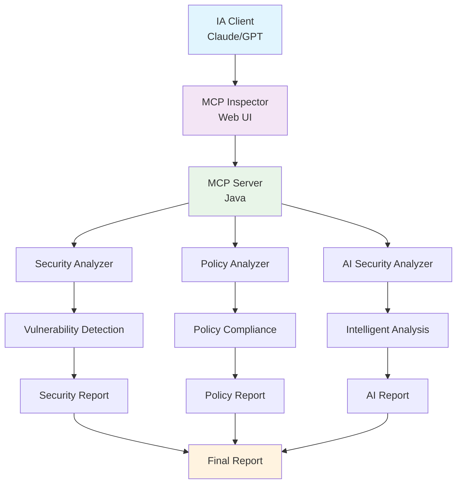

### Flujo de Datos

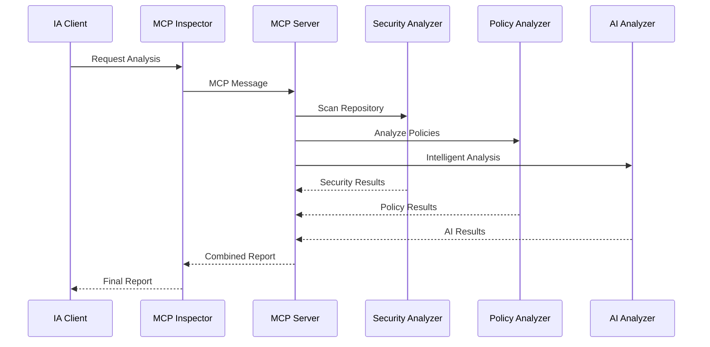

## 🔍 Componentes Detallados

### MCP Server Architecture

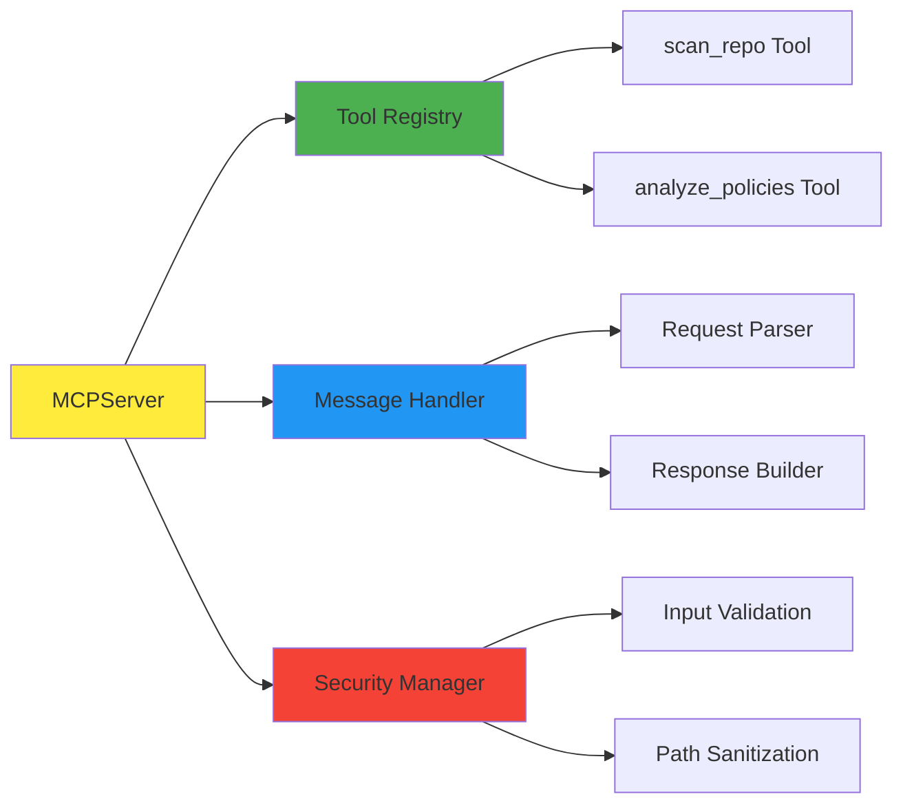

### Security Analyzer Flow

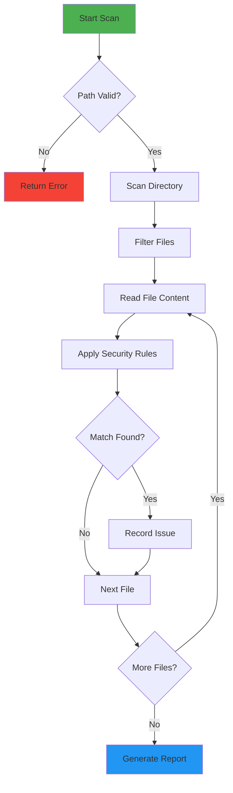

### Policy Analyzer Flow

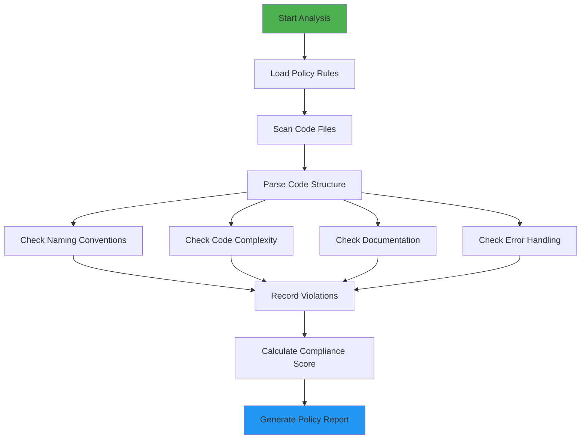

## 🤖 Integración con IA

### AI Analysis Engine

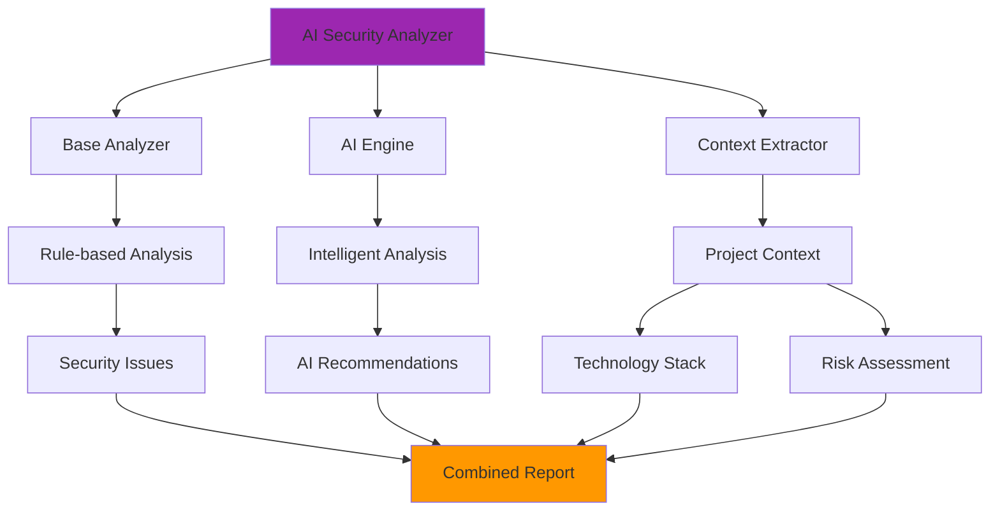

### Context Extraction Process

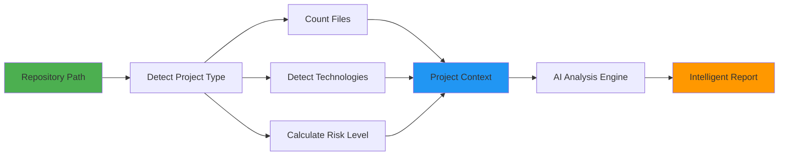

## 📄 Procesamiento de Documentos

### File Processing Pipeline

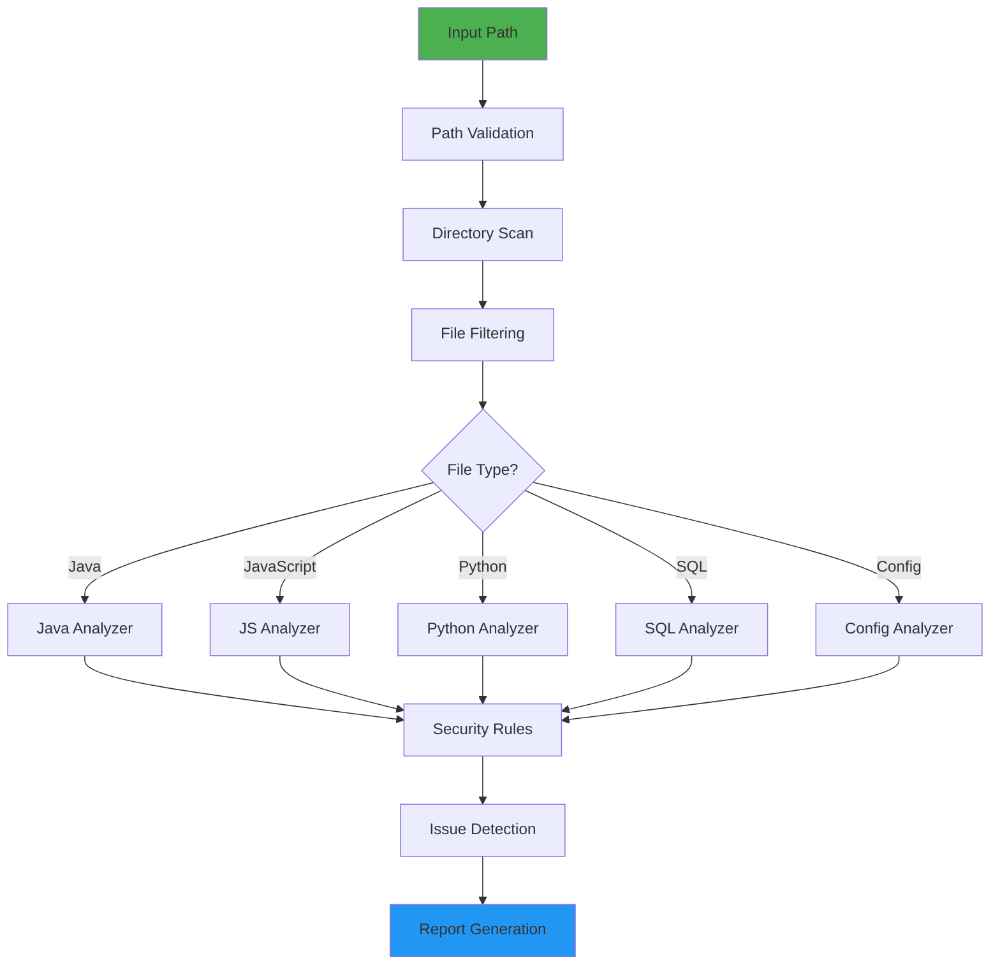

### Security Rule Engine

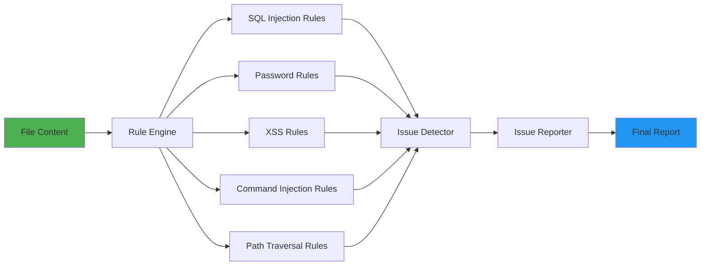

## 🔄 Flujo de Trabajo MCP

### MCP Protocol Flow

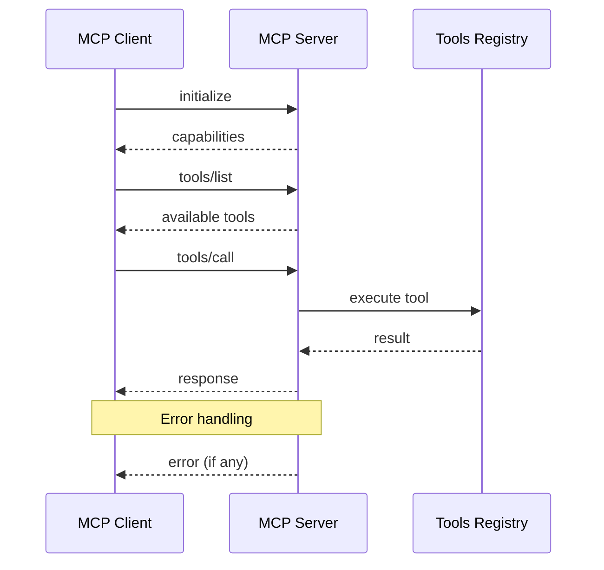

### Tool Execution Flow

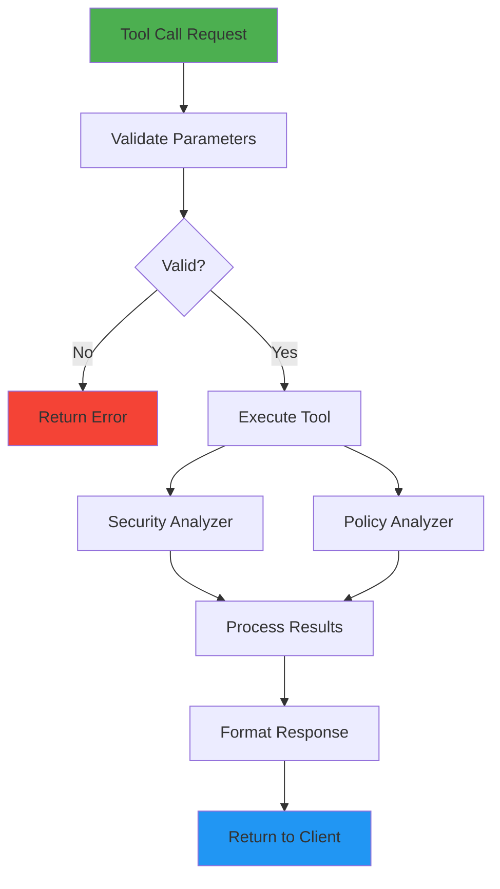

## 🎯 Casos de Uso

### Análisis de Seguridad

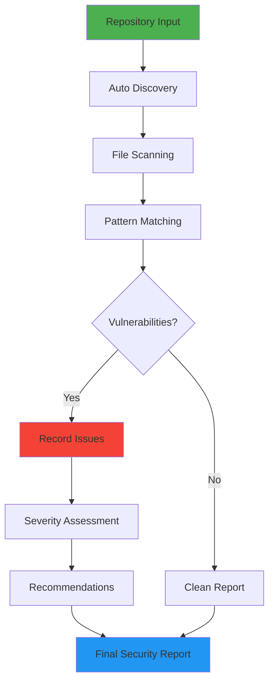

### Análisis de Políticas

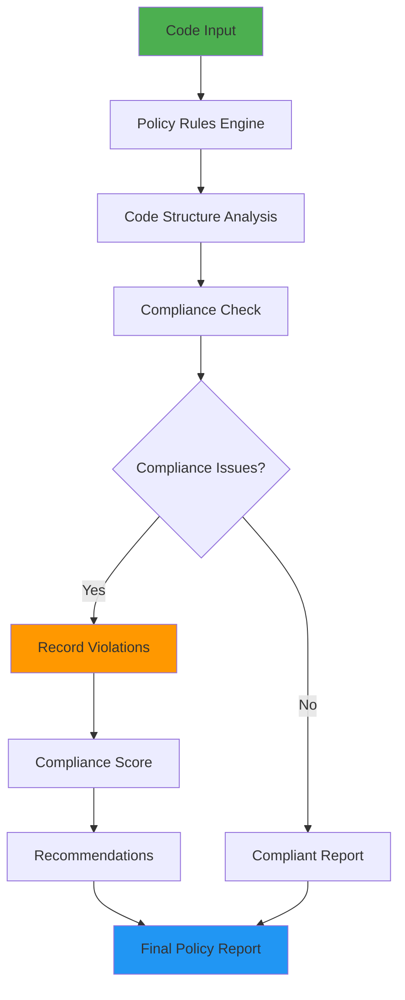

## 🔧 Configuración y Despliegue

### Deployment Architecture

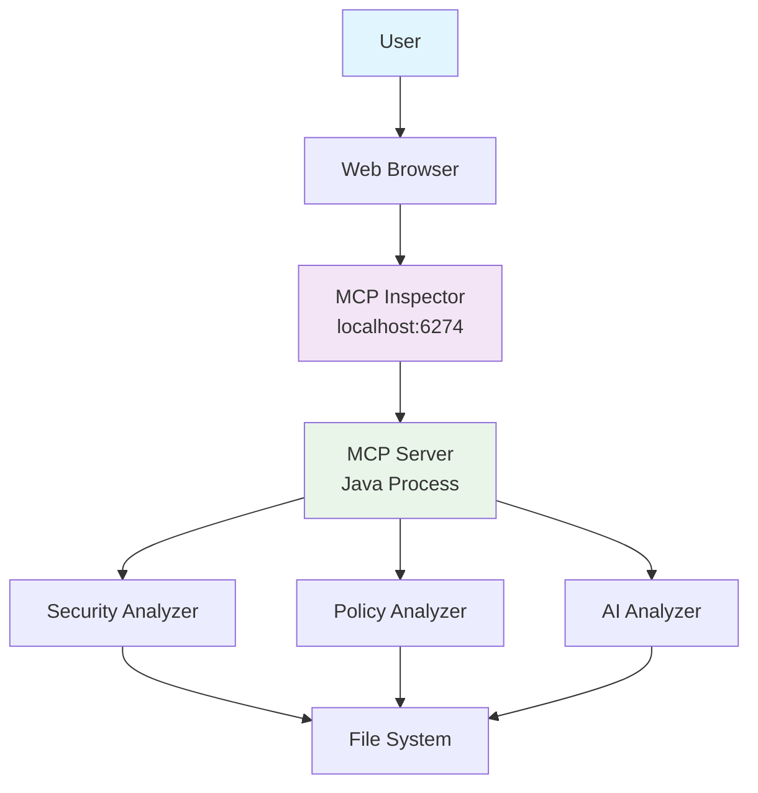

### CI/CD Integration

## 📊 Métricas y Monitoreo

### Performance Metrics

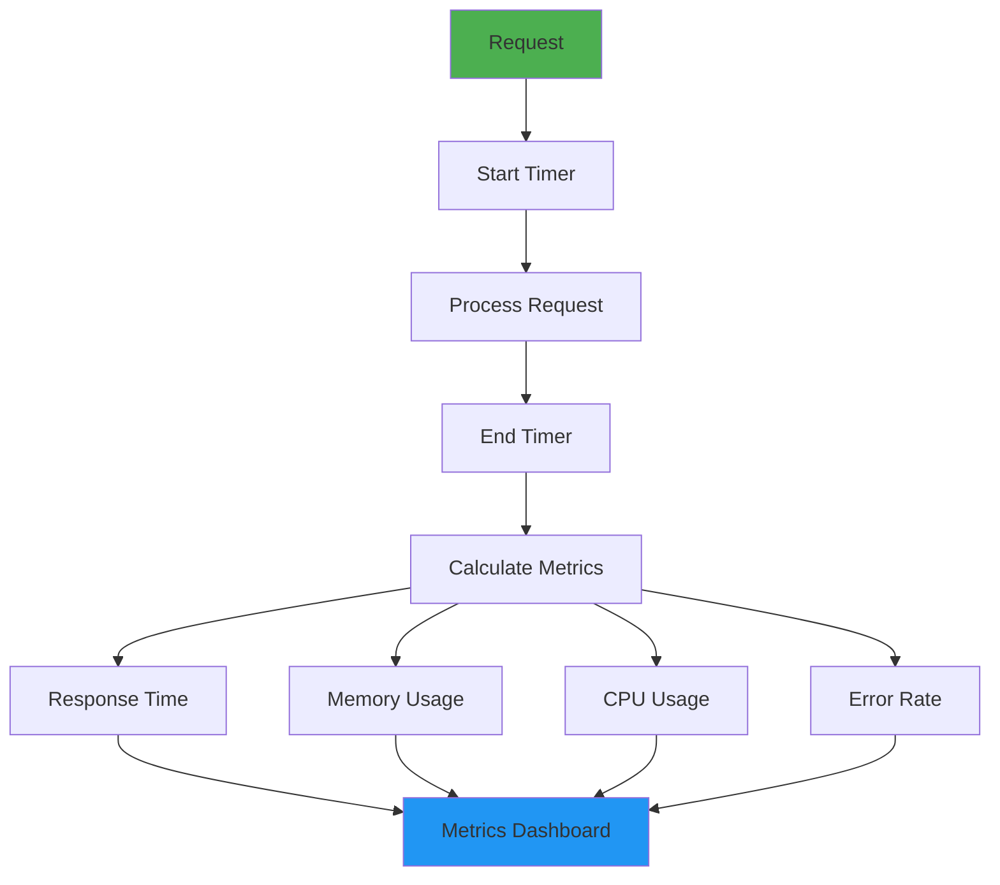

### Error Handling Flow

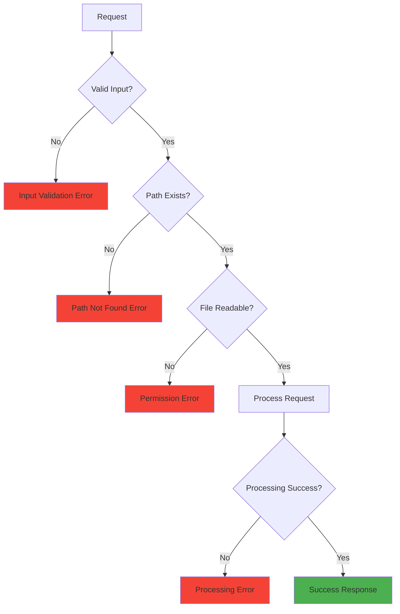

---

## 📝 Notas de los Diagramas

### Convenciones Utilizadas:

- **🟢 Verde**: Procesos exitosos/entrada
- **🔵 Azul**: Procesamiento/transformación
- **🟡 Amarillo**: Componentes principales
- **🔴 Rojo**: Errores/vulnerabilidades
- **🟠 Naranja**: Advertencias/violaciones
- **🟣 Morado**: Componentes de IA

### Herramientas de Generación:

- **Mermaid**: Diagramas de flujo y secuencia
- **PlantUML**: Diagramas de arquitectura
- **Draw.io**: Diagramas de alto nivel

### Mantenimiento:

- Actualizar diagramas cuando cambie la arquitectura
- Mantener consistencia en colores y estilos
- Documentar cambios en versiones 